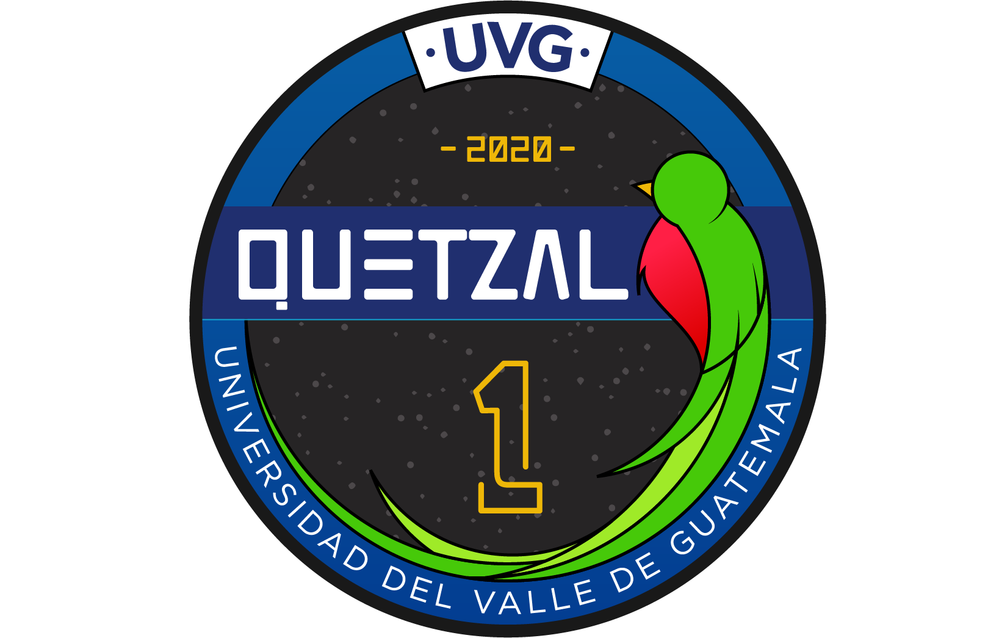

# Quetzal-1 Software

For an overview of Quetzal-1, [read our profile!](https://github.com/Quetzal-1-CubeSat-Team)

## Directory Description

This repository serves as the central location for the flight software for Quetzal-1. We are indebted to the open-source community, as a large part of the hardware and software was inspired and based on open-source platforms, such as [Arduino](https://www.arduino.cc/), and libraries written by its ever-expanding community.

The software for the following subsystems is included in this repository:

1. [ADCS](./ADCS/): contains the software for the Attitude Determination and Control System (ADCS).
2. [EPS](./EPS/): contains the software for the Electrical Power System (EPS).

Lastly, the [media/](./media/) directory contains miscellaneous photos relating to the satellite in general, that may be of use and serve as reference to the user.

## License

The Arduino sketches ([EPS.ino](./EPS/src/EPS/EPS.ino) and [ADCS.ino](./ADCS/src/ADCS/ADCS.ino)) and corresponding header files ([EPS.h](./EPS/src/EPS/EPS.h) and [ADCS.h](./ADCS/src/ADCS/ADCS.h)) written by the Quetzal-1 CubeSat Team are licensed under GPLv3 (see [LICENSE](./LICENSE)).

However, all included libraries (that is, all files under the [ADCS/src/](./ADCS/src/ADCS/src/) or [EPS/src](./EPS/src/EPS/src/) directories) are distributed here for ease-of-use and under their original license (if applicable) and contain a `LICENSE` file within their own subdirectory (if available). 

A list of all included libraries, their usage and license is shown below:

| Library         | Used in   | License              |
|-----------------|-----------|----------------------|
| TMP100          | EPS, ADCS | Beerware             |
| SoftwareWire    | EPS, ADCS | GPLv3                |
| LowPower        | ADCS      | CC BY-SA 3.0         |
| ADC128D818      | ADCS      | No available license |
| Adafruit_Sensor | ADCS      | Apache 2.0           |
| Adafruit_BNO055 | ADCS      | MIT                  |
| BQ27441         | EPS       | MIT                  |
| INA260          | EPS       | BSD                  |

## Available Repositories

| Repository               | Description                                                                                                             |
|--------------------------|-------------------------------------------------------------------------------------------------------------------------|
| [quetzal1-hardware](https://github.com/Quetzal-1-CubeSat-Team/quetzal1-hardware)        | Contains the hardware design files for Quetzal-1 and its subsystems.                                                    |
| quetzal1-flight-software | This repository.                                                                 |
| [gr-quetzal1](https://github.com/danalvarez/gr-quetzal1)              | Contains the software used on the Ground Control Station for Quetzal-1, based on GNURadio. |